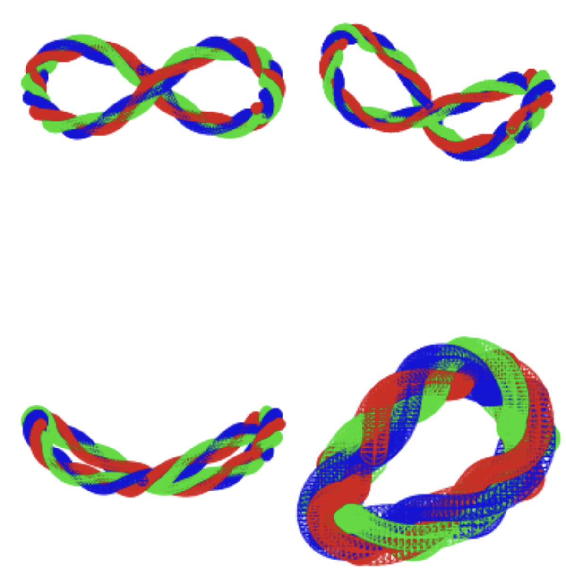
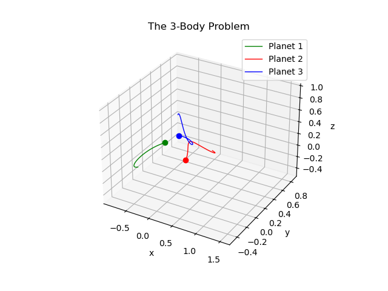
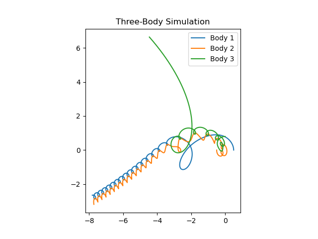
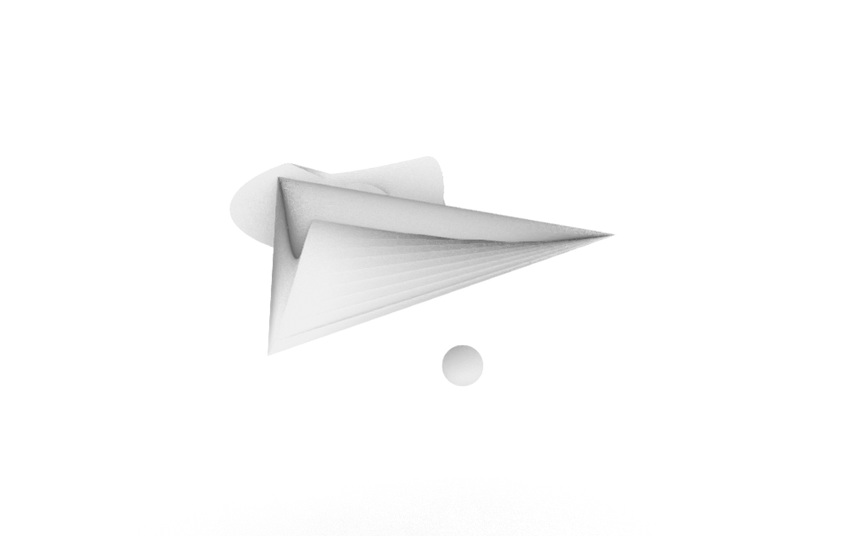
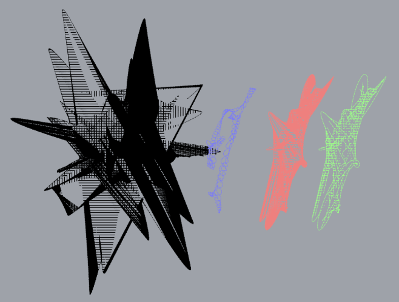
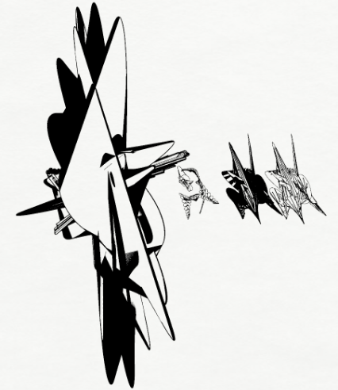
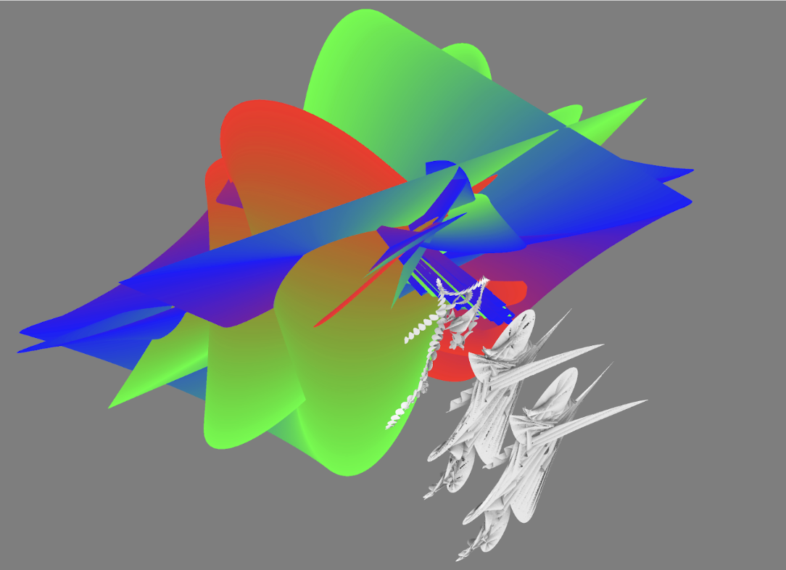
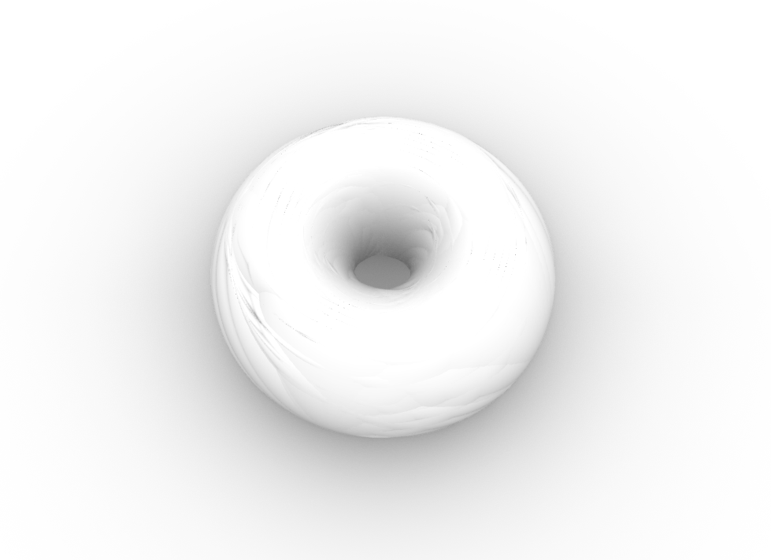
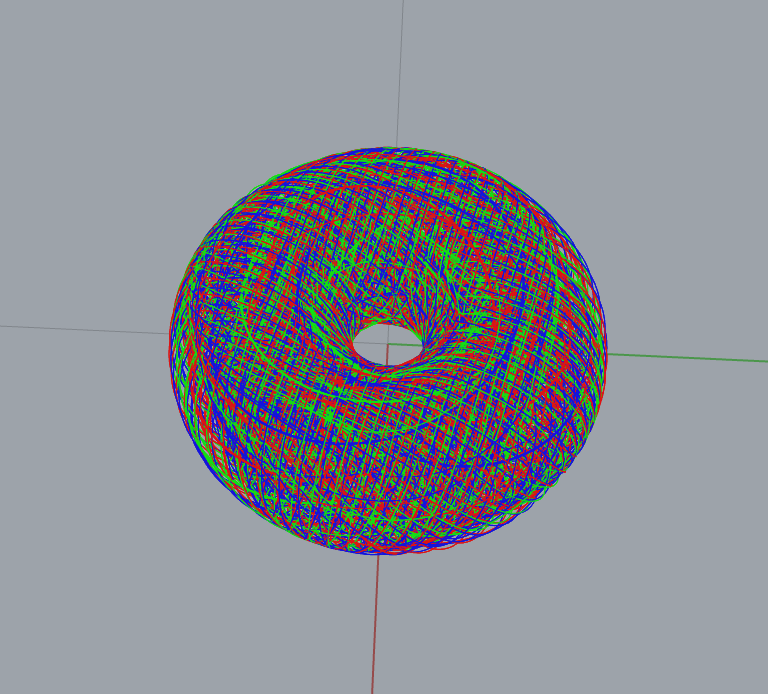
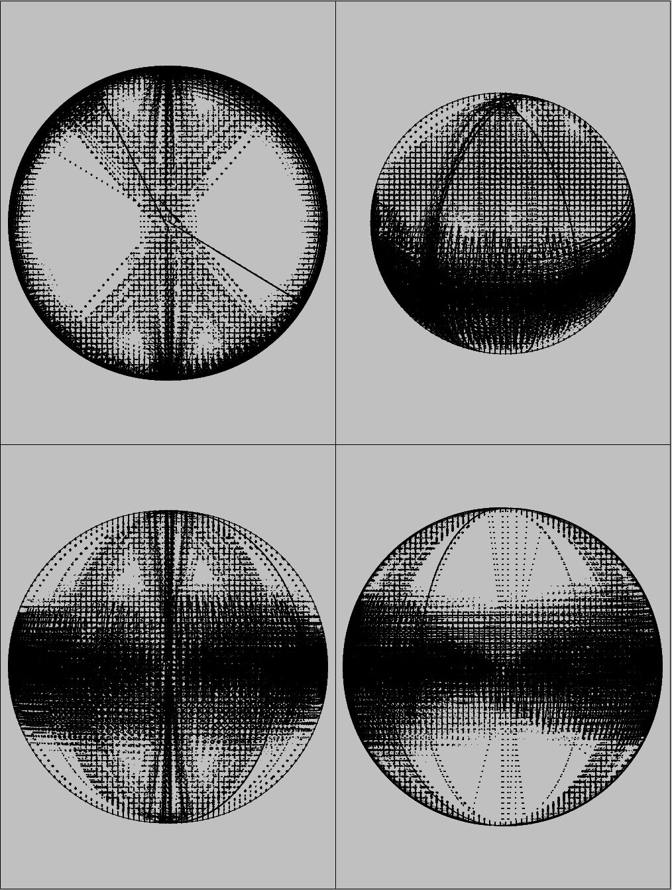

# Proposal

Figure-8 Braided Sphere Sculpture
Parameter Study (Rhino Python)

This project investigates how parameter variation affects a braided sculptural form derived from a stable figure-8 three-body orbit.

The base orbit remains fixed; only selected parameters are adjusted to study changes in density, twist, spatial separation, and scale.

Run in Rhino only.
Requires EditPythonScript and rhinoscriptsyntax.
Not compatible with standard Python.

Base Parameters
TOTAL_STEPS = 632
DT          = 0.01
SCALE       = 40.0

SPHERE_RADIUS = 1.8
DENSITY       = 2

TWIST_RATE    = 0.15
BRAID_WIDTH   = 2.5

This configuration is used as the reference state.

Parameter Variations
1. Density — DENSITY

Controls sphere spacing along the curve.

Low → solid, continuous braid

High → lighter, more porous structure

2. Braid Width — BRAID_WIDTH

Controls radial separation of strands.

Low → tight, rope-like

High → open, spatially expressive

3. Twist Rate — TWIST_RATE

Controls rotational speed around the core path.

Low → calm, relaxed braid

High → tense, highly twisted form

4. Scale — SCALE

Controls overall size in Rhino units.

Small → object-scale

Large → installation-scale

5. Sphere Radius — SPHERE_RADIUS

Controls visual weight and thickness.

Small → light, filament-like

Large → heavy, monumental

Controlled Variables

To ensure comparability, the following remain constant:

Initial orbit conditions

Number of bodies

Time step (DT)

Simulation length (TOTAL_STEPS)

Evaluation Criteria

Continuity

Legibility of strands

Density (solid vs void)

Spatial complexity

Fabrication potential

Implementation Notes

Only one body defines the core figure-8 path.

A subtle Z-axis sinusoidal perturbation introduces 3D depth.

Perpendicular frames are used for consistent braiding.

Temporary guide geometry is deleted after generation.

Script (Rhino Python)
# -*- coding: utf-8 -*-
import rhinoscriptsyntax as rs
import math
# ------------------------------------------------------------------
# Figure-8 Braided Sphere Sculpture (Infinite Loop)
# ------------------------------------------------------------------

def create_braided_sculpture():
    rs.EnableRedraw(False)
    
    print("1. Initializing Infinite Pattern...")
    
    # --- Constants for the Stable Figure-8 Orbit ---
    # These precise numbers ensure the loop closes perfectly
    p1_x = 0.97000436
    p1_y = -0.24308753
    v1_x = 0.46620368
    v1_y = 0.43236573
    v3_x = -2 * v1_x
    v3_y = -2 * v1_y
    
    # --- Simulation Settings ---
    # Total steps to complete one full loop
    TOTAL_STEPS = 632 
    DT = 0.01
    SCALE = 40.0
    
    # Sphere settings
    SPHERE_RADIUS = 1.8  # Size of the balls
    DENSITY = 2          # Draw a sphere every N steps (Lower = denser)
    
    # Braiding settings (How much they twist around each other)
    TWIST_RATE = 0.15    # Speed of rotation around the core
    BRAID_WIDTH = 2.5    # How far apart the colors are
    
    # Initial Physics State
    bodies_pos = [
        [p1_x, p1_y, 0],       # Body 1
        [-p1_x, -p1_y, 0],     # Body 2
        [0, 0, 0]              # Body 3
    ]
    bodies_vel = [
        [v1_x, v1_y, 0],
        [v1_x, v1_y, 0],
        [v3_x, v3_y, 0]
    ]
    
    # Storage for the core path
    core_path = []
    
    print("2. Calculating Trajectory...")
    
    # Physics Loop (Newtonian Gravity)
    for t in range(TOTAL_STEPS):
        forces = [[0.0, 0.0, 0.0] for _ in range(3)]
        
        for i in range(3):
            for j in range(3):
                if i == j: continue
                dx = bodies_pos[j][0] - bodies_pos[i][0]
                dy = bodies_pos[j][1] - bodies_pos[i][1]
                dz = bodies_pos[j][2] - bodies_pos[i][2]
                dist_sq = dx*dx + dy*dy + dz*dz
                dist = math.sqrt(dist_sq)
                f = 1.0 / dist_sq
                
                forces[i][0] += f * (dx/dist)
                forces[i][1] += f * (dy/dist)
                forces[i][2] += f * (dz/dist)
        
        # Update Velocity & Position
        for i in range(3):
            bodies_vel[i][0] += forces[i][0] * DT
            bodies_vel[i][1] += forces[i][1] * DT
            bodies_vel[i][2] += forces[i][2] * DT
            bodies_pos[i][0] += bodies_vel[i][0] * DT
            bodies_pos[i][1] += bodies_vel[i][1] * DT
            bodies_pos[i][2] += bodies_vel[i][2] * DT
            
        # Track ONE body to define the core curve
        x = bodies_pos[0][0]
        y = bodies_pos[0][1]
        
        # Slight 3D wave for sculptural depth
        z = math.sin(t * 0.02) * 0.3 
        
        core_path.append( (x*SCALE, y*SCALE, z*SCALE) )

    print("3. Generating Spheres...")
    
    # Create Layers
    layer_names = ["Orbit_Red", "Orbit_Green", "Orbit_Blue"]
    layer_colors = [(220, 20, 20), (20, 220, 20), (20, 20, 220)]
    
    for i in range(3):
        if not rs.IsLayer(layer_names[i]): 
            rs.AddLayer(layer_names[i], layer_colors[i])

    # Temporary curve for perpendicular frames
    temp_crv = rs.AddInterpCurve(core_path)
    if not temp_crv: return
    
    crv_domain = rs.CurveDomain(temp_crv)
    
    step_size = (crv_domain[1] - crv_domain[0]) / (len(core_path) / DENSITY)
    
    current_t = crv_domain[0]
    counter = 0
    
    while current_t <= crv_domain[1]:
        plane = rs.CurvePerpFrame(temp_crv, current_t)
        rotation_base = counter * TWIST_RATE
        
        for k in range(3):
            rs.CurrentLayer(layer_names[k])
            angle = rotation_base + (k * (2 * math.pi / 3))
            
            vec_u = rs.VectorScale(plane.XAxis, math.cos(angle) * BRAID_WIDTH)
            vec_v = rs.VectorScale(plane.YAxis, math.sin(angle) * BRAID_WIDTH)
            
            sphere_center = rs.PointAdd(plane.Origin, rs.VectorAdd(vec_u, vec_v))
            rs.AddSphere(sphere_center, SPHERE_RADIUS)
            
        current_t += step_size
        counter += 1
        
    rs.DeleteObject(temp_crv)
    
    rs.EnableRedraw(True)
    rs.ZoomExtents()
    print("Done. Braided sphere sculpture created.")

# Three-Body Orbital Dynamics Simulator
import numpy as np
import matplotlib.pyplot as plt
from scipy.integrate import solve_ivp
import time

# ------------------------------------------------------------------- #

m1 = 1.0
m2 = 1.0
m3 = 1.0

# Position
inital_position_1 =  [-0.5,  0.0,  0.0]
inital_position_2 =  [0.5,  0.0,  0.0]
inital_position_3 =  [0.0,   0.001, 1.0]

# Velocity
inital_velocity_1 =  [0.0, 0.347111, 0]
inital_velocity_2 =  [0.0, -0.347111, 0.0]
inital_velocity_3 =  [0.0, 0.0, -0.1]

initial_conditions = np.array([
    inital_position_1, inital_position_2, inital_position_3,
    inital_velocity_1, inital_velocity_2, inital_velocity_3
]).ravel()

# ------------------------------------------------------------------- #

def system_odes(t, S, m1, m2, m3):
    p1, p2, p3 = S[0:3], S[3:6], S[6:9]
    dp1_dt, dp2_dt, dp3_dt = S[9:12], S[12:15], S[15:18]

    f1, f2, f3 = dp1_dt, dp2_dt, dp3_dt

    df1_dt = m3*(p3 - p1)/np.linalg.norm(p3 - p1)**3 + m2*(p2 - p1)/np.linalg.norm(p2 - p1)**3
    df2_dt = m3*(p3 - p2)/np.linalg.norm(p3 - p2)**3 + m1*(p1 - p2)/np.linalg.norm(p1 - p2)**3
    df3_dt = m1*(p1 - p3)/np.linalg.norm(p1 - p3)**3 + m2*(p2 - p3)/np.linalg.norm(p2 - p3)**3

    return np.array([f1, f2, f3, df1_dt, df2_dt, df3_dt]).ravel()

# ------------------------------------------------------------------- #

time_s, time_e = 0, 7
t_points = np.linspace(time_s, time_e, 2001)

t1 = time.time()
solution = solve_ivp(
    fun=system_odes,
    t_span=(time_s, time_e),
    y0=initial_conditions,
    t_eval=t_points,
    args=(m1, m2, m3)
)
t2 = time.time()
print(f"Solved in: {t2-t1:.3f} [s]")

t_sol = solution.t
p1x_sol = solution.y[0]
p1y_sol = solution.y[1]
p1z_sol = solution.y[2]

p2x_sol = solution.y[3]
p2y_sol = solution.y[4]
p2z_sol = solution.y[5]

p3x_sol = solution.y[6]
p3y_sol = solution.y[7]
p3z_sol = solution.y[8]

# ------------------------------------------------------------------- #

fig, ax = plt.subplots(subplot_kw={"projection":"3d"})

planet1_plt, = ax.plot(p1x_sol, p1y_sol, p1z_sol, 'green', label='Planet 1', linewidth=1)
planet2_plt, = ax.plot(p2x_sol, p2y_sol, p2z_sol, 'red', label='Planet 2', linewidth=1)
planet3_plt, = ax.plot(p3x_sol, p3y_sol, p3z_sol, 'blue',label='Planet 3', linewidth=1)

planet1_dot, = ax.plot([p1x_sol[-1]], [p1y_sol[-1]], [p1z_sol[-1]], 'o', color='green', markersize=6)
planet2_dot, = ax.plot([p2x_sol[-1]], [p2y_sol[-1]], [p2z_sol[-1]], 'o', color='red', markersize=6)
planet3_dot, = ax.plot([p3x_sol[-1]], [p3y_sol[-1]], [p3z_sol[-1]], 'o', color='blue', markersize=6)

ax.set_title("The 3-Body Problem")
ax.set_xlabel("x")
ax.set_ylabel("y")
ax.set_zlabel("z")
plt.grid()
plt.legend()

# ------------------------------------------------------------------- #

from matplotlib.animation import FuncAnimation

# -------  Animating the solutions ------- #

def update(frame):
    lower_lim = max(0, frame - 300)
    print(f"Progress: {(frame+1)/len(t_points):.1%} | 100.0 %", end='\r')

    x_current_1 = p1x_sol[lower_lim:frame+1]
    y_current_1 = p1y_sol[lower_lim:frame+1]
    z_current_1 = p1z_sol[lower_lim:frame+1]

    x_current_2 = p2x_sol[lower_lim:frame+1]
    y_current_2 = p2y_sol[lower_lim:frame+1]
    z_current_2 = p2z_sol[lower_lim:frame+1]

    x_current_3 = p3x_sol[lower_lim:frame+1]
    y_current_3 = p3y_sol[lower_lim:frame+1]
    z_current_3 = p3z_sol[lower_lim:frame+1]

    planet1_plt.set_data(x_current_1, y_current_1)  
    planet1_plt.set_3d_properties(z_current_1)

    planet1_dot.set_data([x_current_1[-1]], [y_current_1[-1]])
    planet1_dot.set_3d_properties([z_current_1[-1]])

    planet2_plt.set_data(x_current_2, y_current_2)  
    planet2_plt.set_3d_properties(z_current_2)

    planet2_dot.set_data([x_current_2[-1]], [y_current_2[-1]])
    planet2_dot.set_3d_properties([z_current_2[-1]])

    planet3_plt.set_data(x_current_3, y_current_3)  
    planet3_plt.set_3d_properties(z_current_3)

    planet3_dot.set_data([x_current_3[-1]], [y_current_3[-1]])
    planet3_dot.set_3d_properties([z_current_3[-1]])

    return planet1_plt, planet1_dot, planet2_plt, planet2_dot, planet3_plt, planet3_dot 

animation = FuncAnimation(fig, update, frames=range(0, len(t_points), 2), interval=10, blit=True)
plt.show()

# 2D Three-Body Motion
import numpy as np
import matplotlib.pyplot as plt

# --- 三體引力參數 ---
G = 1.0  # 引力常數

# 初始質量
m1, m2, m3 = 1.0, 1.0, 1.0

# 初始位置 (可改)
r1 = np.array([0.5, 0.0])
r2 = np.array([-0.5, 0.0])
r3 = np.array([0.0, 0.8])

# 初始速度 (可改)
v1 = np.array([0.0, 1.0])
v2 = np.array([0.0, -1.0])
v3 = np.array([-1.0, 0.0])

# 用來存軌跡
r1_list, r2_list, r3_list = [], [], []

# --- 引力加速度 ---
def acceleration(r, ra, m):
    diff = ra - r
    dist3 = np.linalg.norm(diff)**3
    return G * m * diff / dist3

# --- 時間迭代參數 ---
dt = 0.001
steps = 20000   # 可改（越大越久）

# --- 主迴圈 ---
for _ in range(steps):
    # 計算三體間加速度
    a1 = acceleration(r1, r2, m2) + acceleration(r1, r3, m3)
    a2 = acceleration(r2, r1, m1) + acceleration(r2, r3, m3)
    a3 = acceleration(r3, r1, m1) + acceleration(r3, r2, m2)

    # 更新速度
    v1 += a1 * dt
    v2 += a2 * dt
    v3 += a3 * dt

    # 更新位置
    r1 += v1 * dt
    r2 += v2 * dt
    r3 += v3 * dt

    # 保存軌跡
    r1_list.append(r1.copy())
    r2_list.append(r2.copy())
    r3_list.append(r3.copy())

# --- 畫圖 ---
r1_list, r2_list, r3_list = np.array(r1_list), np.array(r2_list), np.array(r3_list)

plt.plot(r1_list[:,0], r1_list[:,1], label="Body 1")
plt.plot(r2_list[:,0], r2_list[:,1], label="Body 2")
plt.plot(r3_list[:,0], r3_list[:,1], label="Body 3")
plt.legend()
plt.gca().set_aspect('equal', 'box')
plt.title("Three-Body Simulation")
plt.show()

# Visible Entangled Ribbons
# Please open with Rhino8
# -*- coding: utf-8 -*-
import rhinoscriptsyntax as rs
import math
import random

# ------------------------------------------------------------------
# Visible Entangled Ribbons (Surface Loft Version)
# ------------------------------------------------------------------

def create_sculpture():
    rs.EnableRedraw(False)
    
    # 1. Initialization
    print("Initializing...")
    SCALE = 50.0  # Scale factor for visibility
    STEPS = 1000  # Simulation length
    G = 1.0
    softening = 2.0 
    
    # Create Layers with RGB colors
    layers = ["Ribbon_A", "Ribbon_B", "Ribbon_C"]
    colors = [(255, 50, 50), (50, 255, 50), (50, 50, 255)]
    
    
    for i in range(3):
        if not rs.IsLayer(layers[i]): rs.AddLayer(layers[i], colors[i])

    # 2. Physics Parameters & Setup
    bodies = []
    # Randomize bodies within a constrained area
    for i in range(3):
        bodies.append({
            'x': random.uniform(-2, 2),
            'y': random.uniform(-2, 2),
            'z': random.uniform(-2, 2),
            'vx': random.uniform(-0.5, 0.5),
            'vy': random.uniform(-0.5, 0.5),
            'vz': random.uniform(-0.5, 0.5),
            'mass': random.uniform(3.0, 6.0),
            'history': []
        })

    print("Simulating Physics (Strong Entanglement)...")
    
    # 3. Physics Simulation Loop
    for t in range(STEPS):
        forces = [[0.0, 0.0, 0.0] for _ in range(3)]
        
        for i in range(3):
            b1 = bodies[i]
            
            # A. Gravitational Force
            for j in range(3):
                if i == j: continue
                b2 = bodies[j]
                
                dx = b2['x'] - b1['x']
                dy = b2['y'] - b1['y']
                dz = b2['z'] - b1['z']
                dist_sq = dx**2 + dy**2 + dz**2 + 0.1 # +0.1 to avoid zero division
                dist = math.sqrt(dist_sq)
                
                f =  G * b1['mass'] * b2['mass'] / (dist_sq + softening)
                forces[i][0] += f * (dx/dist)
                forces[i][1] += f * (dy/dist)
                forces[i][2] += f * (dz/dist)
            
            # B. Strong Center Spring Force (The Anchor)
            # This prevents any planet from flying away (fixes the lonely blue planet)
            dist_origin = math.sqrt(b1['x']**2 + b1['y']**2 + b1['z']**2)
            if dist_origin > 4.0:
                pull = (dist_origin - 4.0) * 0.5 # Stronger pull the further it gets
                forces[i][0] -= b1['x'] * pull
                forces[i][1] -= b1['y'] * pull
                forces[i][2] -= b1['z'] * pull

        # Update Position and Velocity
        dt = 0.006
        for i in range(3):
            b = bodies[i]
            b['vx'] += forces[i][0] / b['mass'] * dt
            b['vy'] += forces[i][1] / b['mass'] * dt
            b['vz'] += forces[i][2] / b['mass'] * dt
            b['x'] += b['vx'] * dt
            b['y'] += b['vy'] * dt
            b['z'] += b['vz'] * dt
            
            # Store Scaled Point
            if t % 50 == 0:
                b['history'].append( (b['x']*SCALE, b['y']*SCALE, b['z']*SCALE) )

    # 4. Generate Geometry (Ribbons)
    print("Building Geometry...")
    
    curves = []
    # Generate the 3 main path curves first
    for i in range(3):
        pts = bodies[i]['history']
        if len(pts) > 2:
            crv = rs.AddInterpCurve(pts)
            curves.append(crv)
        else:
            curves.append(None)

    # Generate Surfaces between curves (Loft)
    # Connections: 0-1, 1-2, 2-0 (Closed Loop of Ribbons)
    pairs = [(0, 1), (1, 2), (2, 0)]
    
    created_objects = []
    
    for idx, (i, j) in enumerate(pairs):
        c1 = curves[i]
        c2 = curves[j]
        
        if c1 and c2:
            rs.CurrentLayer(layers[idx]) 
            
            try:
                # Create Loft Surface between the two curves
                srf = rs.AddLoftSrf([c1, c2], start=None, end=None, closed=False, loft_type=0)
                if srf:
                    created_objects.extend(srf)
                    rs.ObjectColor(srf, colors[idx])
            except:
                print("Loft failed for pair " + str(i) + "-" + str(j))

    # 5. Cleanup and Display
    if len(created_objects) > 0:
        rs.DeleteObjects(curves) # Remove guide curves, keep surfaces
        print("Success! Created " + str(len(created_objects)) + " ribbons.")
    else:
        print("Geometry generation failed. Keeping curves.")

    rs.EnableRedraw(True)
    rs.ZoomExtents()
    
    # Add a reference sphere at the center so you can find the object
    rs.CurrentLayer("Default")
    rs.AddSphere([0,0,0], SCALE/5.0)

if __name__ == "__main__":
    create_sculpture()

# ------------------------------------------------------------------
# Visible Entangled Ribbons (Surface Loft Version)
# ------------------------------------------------------------------

This script generates a sculptural geometry in Rhino by simulating a simple three-body system and translating its motion into entangled ribbon-like surfaces.
Three bodies interact through mutual gravitational forces and a strong central anchoring force.
Their trajectories are recorded over time, converted into curves, and then lofted pairwise to form a closed loop of flowing ribbon surfaces.
This script must be opened and executed in Rhino
It relies on rhinoscriptsyntax and will not run in a standard Python environment.

def create_sculpture():
    rs.EnableRedraw(False)
    
    # 1. Initialization
    print("Initializing...")
    SCALE = 50.0  # Scale factor for visibility
    STEPS = 2000  # Simulation length
    
    # Create Layers with RGB colors
    layers = ["Ribbon_A", "Ribbon_B", "Ribbon_C"]
    colors = [(255, 50, 50), (50, 255, 50), (50, 50, 255)]
    
    for i in range(3):
        if not rs.IsLayer(layers[i]):
            rs.AddLayer(layers[i], colors[i])

    # 2. Physics Parameters & Setup
    bodies = []
    for i in range(3):
        bodies.append({
            'x': random.uniform(-2, 2),
            'y': random.uniform(-2, 2),
            'z': random.uniform(-2, 2),
            'vx': random.uniform(-0.5, 0.5),
            'vy': random.uniform(-0.5, 0.5),
            'vz': random.uniform(-0.5, 0.5),
            'mass': random.uniform(3.0, 6.0),
            'history': []
        })

    print("Simulating Physics...")
    
    # 3. Simulation Loop
    for t in range(STEPS):
        forces = [[0.0, 0.0, 0.0] for _ in range(3)]
        
        for i in range(3):
            b1 = bodies[i]
            for j in range(3):
                if i == j:
                    continue
                b2 = bodies[j]
                
                dx = b2['x'] - b1['x']
                dy = b2['y'] - b1['y']
                dz = b2['z'] - b1['z']
                dist_sq = dx**2 + dy**2 + dz**2 + 0.1
                dist = math.sqrt(dist_sq)
                
                f = (2.0 * b1['mass'] * b2['mass']) / dist_sq
                forces[i][0] += f * (dx/dist)
                forces[i][1] += f * (dy/dist)
                forces[i][2] += f * (dz/dist)

            dist_origin = math.sqrt(b1['x']**2 + b1['y']**2 + b1['z']**2)
            if dist_origin > 4.0:
                pull = (dist_origin - 4.0) * 0.5
                forces[i][0] -= b1['x'] * pull
                forces[i][1] -= b1['y'] * pull
                forces[i][2] -= b1['z'] * pull

        dt = 0.02
        for i in range(3):
            b = bodies[i]
            b['vx'] += forces[i][0] / b['mass'] * dt
            b['vy'] += forces[i][1] / b['mass'] * dt
            b['vz'] += forces[i][2] / b['mass'] * dt
            b['x'] += b['vx'] * dt
            b['y'] += b['vy'] * dt
            b['z'] += b['vz'] * dt
            
            b['history'].append(
                (b['x'] * SCALE, b['y'] * SCALE, b['z'] * SCALE)
            )

    # 4. Geometry Generation
    print("Building Geometry...")
    curves = []
    for i in range(3):
        pts = bodies[i]['history']
        curves.append(rs.AddInterpCurve(pts) if len(pts) > 2 else None)

    pairs = [(0, 1), (1, 2), (2, 0)]
    created_objects = []

    for idx, (i, j) in enumerate(pairs):
        if curves[i] and curves[j]:
            rs.CurrentLayer(layers[idx])
            srf = rs.AddLoftSrf([curves[i], curves[j]])
            if srf:
                created_objects.extend(srf)
                rs.ObjectColor(srf, colors[idx])

    if created_objects:
        rs.DeleteObjects(curves)

    rs.EnableRedraw(True)
    rs.ZoomExtents()
    rs.CurrentLayer("Default")
    rs.AddSphere([0, 0, 0], SCALE / 5.0)

# Dount

# -*- coding: utf-8 -*-
import rhinoscriptsyntax as rs
import math
import sys

# ------------------------------------------------------------------
# Figure-8 Braided Sculpture (Rhino 8 Compatible)
# 功能：物理模擬三體 8 字型軌道，並透過 Loft 建立編織實體
# ------------------------------------------------------------------

def create_braided_sculpture_loft():
    # 確保編碼正常
    if sys.version_info.major < 3:
        try:
            reload(sys)
            sys.setdefaultencoding('utf-8')
        except NameError:
            pass 

    rs.EnableRedraw(False)
    
    # --- 1. 物理初始條件 (Figure-Eight Orbit) ---
    p1_x, p1_y = 0.97000436, -0.24308753
    v1_x, v1_y = 0.46620368, 0.43236573
    v3_x, v3_y = -2 * v1_x, -2 * v1_y
    
    # --- 2. 模擬與幾何設定 ---
    TOTAL_STEPS = 632  # 迴圈總步數
    DT = 0.01          # 時間增量
    SCALE = 40.0       # 放大倍率
    SECTION_RADIUS = 1.8 # 管道粗細
    DENSITY = 2        # 截面密度
    TWIST_RATE = 0.15  # 編織旋轉速度
    BRAID_WIDTH = 2.5  # 編織間距
    
    bodies_pos = [[p1_x, p1_y, 0], [-p1_x, -p1_y, 0], [0, 0, 0]]
    bodies_vel = [[v1_x, v1_y, 0], [v1_x, v1_y, 0], [v3_x, v3_y, 0]]
    core_path = []
    
    # --- 3. 軌跡計算 (物理模擬) ---
    for t in range(TOTAL_STEPS):
        forces = [[0.0, 0.0, 0.0] for _ in range(3)]
        for i in range(3):
            for j in range(3):
                if i == j: continue
                dx, dy, dz = [bodies_pos[j][k] - bodies_pos[i][k] for k in range(3)]
                dist_sq = dx*dx + dy*dy + dz*dz
                dist = math.sqrt(dist_sq)
                f = 1.0 / dist_sq
                forces[i][0] += f * (dx/dist)
                forces[i][1] += f * (dy/dist)
                forces[i][2] += f * (dz/dist)
        
        for i in range(3):
            for k in range(3):
                bodies_vel[i][k] += forces[i][k] * DT
                bodies_pos[i][k] += bodies_vel[i][k] * DT
            
        # 加入 Z 軸波動增加立體感
        z = math.sin(2 * math.pi * t / TOTAL_STEPS) * 0.5 
        core_path.append( (bodies_pos[0][0]*SCALE, bodies_pos[0][1]*SCALE, z*SCALE) )

    # --- 4. Rhino 幾何生成 ---
    layer_names = ["Orbit_Red", "Orbit_Green", "Orbit_Blue"]
    layer_colors = [(220, 20, 20), (20, 220, 20), (20, 20, 220)]
    for n, c in zip(layer_names, layer_colors):
        if not rs.IsLayer(n): rs.AddLayer(n, c)

    temp_crv = rs.AddInterpCurve(core_path, degree=3)
    crv_domain = rs.CurveDomain(temp_crv)
    crv_collections = [[], [], []] 
    
    step_size = (crv_domain[1] - crv_domain[0]) / (len(core_path) / DENSITY)
    curr_t = crv_domain[0]
    count = 0
    
    while curr_t <= crv_domain[1]:
        plane = rs.CurvePerpFrame(temp_crv, curr_t)
        rot_base = count * TWIST_RATE
        for k in range(3):
            angle = rot_base + (k * (2 * math.pi / 3))
            vec_u = rs.VectorScale(plane.XAxis, math.cos(angle) * BRAID_WIDTH)
            vec_v = rs.VectorScale(plane.YAxis, math.sin(angle) * BRAID_WIDTH)
            pt = rs.PointAdd(plane.Origin, rs.VectorAdd(vec_u, vec_v))
            circle = rs.AddCircle(pt, SECTION_RADIUS) 
            rs.TransformObject(circle, rs.XformChangeBasis(rs.WorldXYPlane(), plane))
            crv_collections[k].append(circle)
        curr_t += step_size
        count += 1

    # --- 5. 放樣實體 ---
    for k in range(3):
        rs.CurrentLayer(layer_names[k])
        rs.AddLoftSrf(crv_collections[k], loft_type=0, closed=True)
        rs.DeleteObjects(crv_collections[k])

    rs.DeleteObject(temp_crv)
    rs.EnableRedraw(True)
    rs.ZoomExtents()
    print("Sculpture Created Successfully.")

if __name__ == "__main__":
    create_braided_sculpture_loft()

Three-Body Pipe Sculpture (Rhino Python)

This script generates a three-dimensional sculptural form based on a three-body gravitational system, translated into solid pipe geometry in Rhino.

import rhinoscriptsyntax as rs
import math

class Body:
    def __init__(self, mass, pos, vel):
        self.m = mass
        self.p = list(pos) 
        self.v = list(vel) 
        self.path = [tuple(pos)] 

def generate_sculpture():
    rs.EnableRedraw(False)
    
   
    G = 1.0          
    dt = 0.01        
    steps = 1500     
    radius = 40     
    
   
    p1_x, p1_y = 0.97000436, -0.24308753
    v1_x, v1_y = 0.46620368, 0.43236573
    v3_x, v3_y = -2 * v1_x, -2 * v1_y
    
    
    z_perturbation = 0.08 
    
    bodies = []
   
    bodies.append(Body(1.0, [p1_x, p1_y, 0], [v1_x, v1_y, 0]))
    
    bodies.append(Body(1.0, [-p1_x, -p1_y, 0], [v1_x, v1_y, 0]))
   
    bodies.append(Body(1.0, [0, 0, 0], [v3_x, v3_y, z_perturbation]))

    print("Simulating Physics...")
    
    for t in range(steps):
     
        forces = [[0.0, 0.0, 0.0] for _ in range(3)]
        
        for i in range(3):
            for j in range(3):
                if i == j: continue
                
               
                dx = bodies[j].p[0] - bodies[i].p[0]
                dy = bodies[j].p[1] - bodies[i].p[1]
                dz = bodies[j].p[2] - bodies[i].p[2]
                dist_sq = dx*dx + dy*dy + dz*dz
                dist = math.sqrt(dist_sq) + 1e-5 
                
                
                f_mag = (G * bodies[i].m * bodies[j].m) / dist_sq
                
            
                forces[i][0] += f_mag * (dx / dist)
                forces[i][1] += f_mag * (dy / dist)
                forces[i][2] += f_mag * (dz / dist)
        
        
        for i in range(3):
            ax = forces[i][0] / bodies[i].m
            ay = forces[i][1] / bodies[i].m
            az = forces[i][2] / bodies[i].m
            
        
            bodies[i].v[0] += ax * dt
            bodies[i].v[1] += ay * dt
            bodies[i].v[2] += az * dt
            
        
            bodies[i].p[0] += bodies[i].v[0] * dt
            bodies[i].p[1] += bodies[i].v[1] * dt
            bodies[i].p[2] += bodies[i].v[2] * dt
            
            
            if t % 5 == 0:
                bodies[i].path.append(tuple(bodies[i].p))

    print("Building Geometry...")
    generated_pipes = []
    
    
    layer_name = "ThreeBody_Sculpture"
    if not rs.IsLayer(layer_name): rs.AddLayer(layer_name)
    rs.CurrentLayer(layer_name)

    for i, b in enumerate(bodies):
        if len(b.path) > 1:
           
            curve_id = rs.AddInterpCurve(b.path)
            
            pipes = rs.AddPipe(curve_id, 0, radius, cap=1) 
            
            if pipes:
                generated_pipes.extend(pipes)
            
            
            rs.DeleteObject(curve_id)

    if generated_pipes:
        origin = [0,0,0]
        rs.ScaleObjects(generated_pipes, origin, [10, 10, 10])
        print("Done! Sculpture created.")
    
    rs.EnableRedraw(True)

